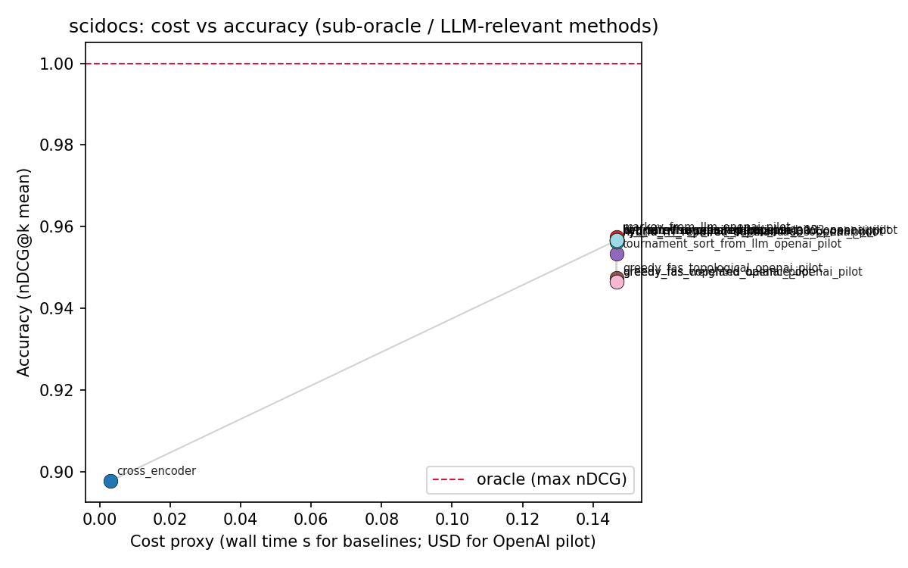

# Cost–accuracy and decision analysis (offline bundle)

This note summarizes an **offline** analysis built from committed artifacts under `outputs/` and `data/`. No API calls were made. The script that regenerates every table and figure is `scripts/generate_cost_accuracy_analysis.py`.

## Scope and important caveats

### What this repository snapshot contains

- **Retrieval ranking experiments** (SciDocs, HotpotQA, BRIGHT, FiQA) with **qrels-derived** preference graphs: summary CSVs under `outputs/final_modern_baselines_reference/` (and `outputs/real_full/fiqa/qrels/` for FiQA).
- **Cross-encoder** accuracy from `outputs/final_modern_baselines/*/ *_modern_baselines_summary.csv`, merged with **wall-clock cost** from the same query slice as the qrels summaries (FiQA uses the small `real_full` pilot slice; see blockers below).
- **Cached OpenAI pairwise pilots** (gpt-4o-mini) for SciDocs and HotpotQA only: `outputs/openai_scidocs_real_run_q20_k15/` and `outputs/openai_hotpotqa_real_run_q10_k15/`. Cost is taken from each run’s `config.json` field `cost_estimate_usd` and is **shared across all methods in that run** (not a per-method marginal cost).

### What is **missing** for the EAAI reasoning-routing manuscript

The following were **not found** anywhere under `outputs/` or `data/`:

| Expected artifact | Status |
|-------------------|--------|
| `real_policy_eval` outputs | **Absent** |
| `multi_action_models` outputs | **Absent** |
| Methods: `reasoning_greedy`, `self_consistency_3`, `self_consistency_5`, `direct_plus_revise`, `reasoning_then_revise`, routing baselines, learned routers | **Absent** |
| Datasets: GSM8K, Hard GSM8K, MATH500 | **Absent** |
| Per-method `revise_rate`, `extra_compute_rate` from those experiments | **Not logged** in the inputs we used (`revise_rate` / `extra_compute_rate` columns are present in `outputs/analysis/unified_results.csv` but are empty except for `extra_compute_rate` derived from runtime ratios) |

A machine-readable list of these gaps is in `outputs/analysis/blocker_report.txt`.

### Metric and cost definitions used here

- **Accuracy**: mean **nDCG@k** as reported in the baseline summary CSVs (`ndcg_mean`), i.e. ranking quality against qrels on the evaluated query set.
- **Oracle accuracy**: **max** nDCG over all methods **included in the unified table** for that dataset (including qrels-oracle-style aggregators that hit nDCG ≈ 1 on these splits).
- **avg_cost**:
  - For qrels baselines: `runtime_mean_s` from the summary CSV (local CPU wall time per query aggregate).
  - For OpenAI pilots: total run **USD** estimate from `config.json`.
- **Mixing cost units**: The unified frame therefore mixes **seconds** and **USD** when both baselines and pilots appear. **Cross-dataset or cross-family comparisons on raw `avg_cost` are not meaningful** until costs are normalized to a single unit (e.g. all USD or all seconds). Within a dataset, the **relative** ordering of cheap local methods is still meaningful; pilots appear as a separate cost scale.

---

## 1. Key plots (cost vs accuracy)

Figures (one per dataset with available rows):

| Dataset | Path |
|---------|------|
| SciDocs | `../outputs/analysis/scidocs_cost_accuracy_curve.png` |
| HotpotQA | `../outputs/analysis/hotpotqa_cost_accuracy_curve.png` |
| BRIGHT | `../outputs/analysis/bright_cost_accuracy_curve.png` |
| FiQA | `../outputs/analysis/fiqa_cost_accuracy_curve.png` |

When many qrels methods tie at nDCG ≈ 1.0, the plotter **filters to sub-oracle methods plus OpenAI pilot rows** so the tradeoff is visible; the title suffix documents this.

Example (SciDocs):



---

## 2. Pareto frontier

For each dataset, `outputs/analysis/{dataset}_pareto.csv` marks whether a method is **Pareto-optimal** under:

- higher **accuracy** is better,
- lower **avg_cost** is better.

**Interpretation on qrels-heavy slices**: many vote-aggregation methods achieve **nDCG = 1** with **identical** mean runtime in the summary files, so they are **mutually non-dominating** (all on the frontier). Methods strictly worse in accuracy at the same cost (e.g. cross-encoder vs perfect qrels aggregators) are labeled dominated.

---

## 3. Regret vs oracle

`outputs/analysis/{dataset}_regret.csv` contains:

- `regret_accuracy = oracle_accuracy - accuracy`
- For λ ∈ {0.10, 0.25}, normalized cost `c_max = max cost` within the dataset:
  - `utility = accuracy - λ * (avg_cost / c_max)`
  - `regret_utility = oracle_utility - method_utility`

**Caveat**: Because cheap baselines share the same cost in the summaries, utility differences collapse to accuracy differences for those rows. OpenAI pilots share one USD cost, so utility ranks among pilot methods mirror accuracy ranks.

---

## 4. When does extra compute help?

From the **available** signals:

- **Qrels oracle-style aggregators** (e.g. `score_sum`, `borda`, many hybrids) already achieve **ceiling nDCG** on these evaluation slices at **minimal** reported runtime; **extra spend on LLM pilots does not improve nDCG** versus that ceiling on the same labeled preferences.
- **Cross-encoder** is the main **non-oracle** local model in the bundle: it sits **below** ceiling accuracy at similar wall time to the cheap aggregators—useful as a **realistic** high-throughput baseline when qrels are not given at inference time.
- **OpenAI pairwise pilots** sit **between** cross-encoder and ceiling on SciDocs/HotpotQA for nDCG but at **much higher USD cost** in the logged runs—informative for **LLM-as-judge** cost, not for “reasoning steps” or revise policies (those experiments are missing).

---

## 5. Differences across datasets

See `outputs/analysis/cross_dataset_insights.csv`.

- **Oracle nDCG** in this bundle is **1.0** for all four datasets (max over included methods).
- **Accuracy spread** (max − min nDCG among included methods) is **zero for FiQA** on this slice (all listed methods hit 1.0), and **non-zero** for SciDocs, HotpotQA, and BRIGHT largely due to **cross-encoder** and **OpenAI** rows where present.
- **Cost ratio** (max / min `avg_cost`) is **1.0** when all methods share the same `runtime_mean_s` in the summary (FiQA, BRIGHT in the reference summaries); HotpotQA and SciDocs show larger ratios once OpenAI USD rows are included.

---

## 6. Deployment recommendations (from this evidence only)

1. **Do not cite this bundle as GSM8K/MATH500 routing results**—those outputs are not in the repo.
2. For **ranking under known qrels** on these slices, **simple aggregators already saturate nDCG**; invest in **better candidates or features**, not more aggregation compute.
3. For **production without qrels**, treat **cross-encoder** (and future LLM judges) as the relevant **accuracy–cost** tradeoff; re-run this script after adding `real_policy_eval` / `multi_action_models` exports so `revise_rate` and multi-step costs enter the same schema.
4. **Normalize cost to one unit** (USD or seconds) before paper-quality cross-method curves that mix families.

---

## Generated files (checklist)

| Output | Path |
|--------|------|
| Unified long table | `outputs/analysis/unified_results.csv` |
| Cost–accuracy figures | `outputs/analysis/{dataset}_cost_accuracy_curve.png` |
| Pareto | `outputs/analysis/{dataset}_pareto.csv` |
| Regret | `outputs/analysis/{dataset}_regret.csv` |
| Budget decision table | `outputs/analysis/{dataset}_decision_table.csv` |
| Cross-dataset summary | `outputs/analysis/cross_dataset_insights.csv` |
| Blocker list | `outputs/analysis/blocker_report.txt` |

Regenerate:

```bash
source /workspace/.venv/bin/activate
python scripts/generate_cost_accuracy_analysis.py
```
